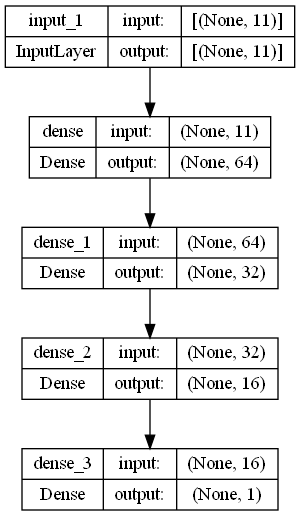
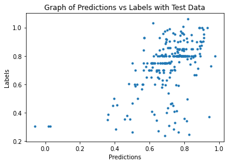

# Diamond Price Prediction Using Feedforward Neural Network
## 1. Summary
The purpose of this project is to create an accurate deep learning model to predict the actual productivity of employees (It can anticipate promotions, transfers and firing of employees in advance). The model is trained with dataset from [Productivity Prediction of Garment Employees](https://www.kaggle.com/datasets/ishadss/productivity-prediction-of-garment-employees).

## 2. IDE and Framework
This project is created using Sypder as the main IDE. The main frameworks used in this project are Pandas, Numpy, Scikit-learn and TensorFlow Keras.

## 3. Methodology
### 3.1. Data Pipeline
The data is first loaded and preprocessed, such that unwanted features are removed, and categorical features are label encoded. Anomalies in the data are also corrected. Then the data is split into train-validation-test sets, with a ratio of 60:20:20.

### 3.2. Model Pipeline
A feedforward neural network is constructed catering for a regression problem. Below is the structure of the dense neural network used in this training.

The model is trained with a batch size of 64 and for 100 epochs. Early stopping is applied in this training. The training stops at epoch 36, with a training MAE of 0.0858 and validation MAE of 0.1187. The two figures below show the graph of the training process, indicating the convergence of model training.

 

## 4. Results
The model are tested with test data. The evaluation result is shown in figure below.

The model is also used to made prediction with test data. A graph of prediction vs label is plotted, as shown in the image below.

Referring to the graph, a trendline of y=x can be seen, indicating the predictions are somewhat similar to the labels. However, several outliers can also be seen in the graph.

